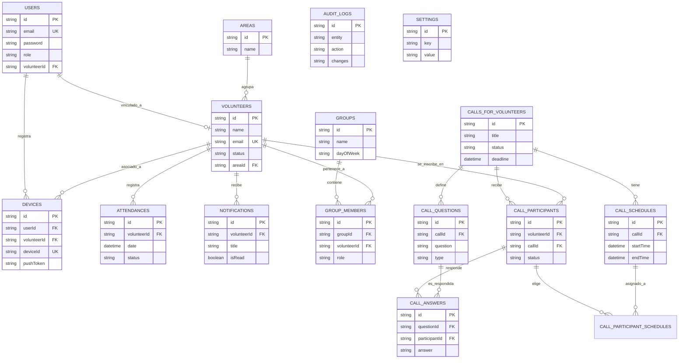

# Database Schema

```mermaid
erDiagram
%% --- Módulo de Identidad y Acceso ---
  USERS ||--o| VOLUNTEERS : "vinculado_a"
  USERS ||--o{ DEVICES : "registra"
  VOLUNTEERS ||--o{ DEVICES : "asociado_a"

%% --- Módulo de Voluntarios y Organización ---
  AREAS ||--o{ VOLUNTEERS : "agrupa"
  VOLUNTEERS ||--o{ ATTENDANCES : "registra"
  VOLUNTEERS ||--o{ NOTIFICATIONS : "recibe"

%% --- Módulo de Grupos ---
  GROUPS ||--o{ GROUP_MEMBERS : "contiene"
  VOLUNTEERS ||--o{ GROUP_MEMBERS : "pertenece_a"

%% --- Módulo de Convocatorias (Calls) ---
  CALLS_FOR_VOLUNTEERS ||--o{ CALL_QUESTIONS : "define"
  CALLS_FOR_VOLUNTEERS ||--o{ CALL_SCHEDULES : "tiene"
  CALLS_FOR_VOLUNTEERS ||--o{ CALL_PARTICIPANTS : "recibe"

  VOLUNTEERS ||--o{ CALL_PARTICIPANTS : "se_inscribe_en"

  CALL_PARTICIPANTS ||--o{ CALL_ANSWERS : "responde"
  CALL_QUESTIONS ||--o{ CALL_ANSWERS : "es_respondida"

  CALL_PARTICIPANTS ||--o{ CALL_PARTICIPANT_SCHEDULES : "elige"
  CALL_SCHEDULES ||--o{ CALL_PARTICIPANT_SCHEDULES : "asignado_a"

  USERS {
    string id PK
    string email UK
    string password
    string role
    string volunteerId FK
  }

  VOLUNTEERS {
    string id PK
    string name
    string email UK
    string status
    string areaId FK
  }

  AREAS {
    string id PK
    string name
  }

  ATTENDANCES {
    string id PK
    string volunteerId FK
    datetime date
    string status
  }

  GROUPS {
    string id PK
    string name
    string dayOfWeek
  }

  GROUP_MEMBERS {
    string id PK
    string groupId FK
    string volunteerId FK
    string role
  }

  CALLS_FOR_VOLUNTEERS {
    string id PK
    string title
    string status
    datetime deadline
  }

  CALL_QUESTIONS {
    string id PK
    string callId FK
    string question
    string type
  }

  CALL_PARTICIPANTS {
    string id PK
    string volunteerId FK
    string callId FK
    string status
  }

  CALL_ANSWERS {
    string id PK
    string questionId FK
    string participantId FK
    string answer
  }

  CALL_SCHEDULES {
    string id PK
    string callId FK
    datetime startTime
    datetime endTime
  }

  NOTIFICATIONS {
    string id PK
    string volunteerId FK
    string title
    boolean isRead
  }

  DEVICES {
    string id PK
    string userId FK
    string volunteerId FK
    string deviceId UK
    string pushToken
  }

  AUDIT_LOGS {
    string id PK
    string entity
    string action
    string changes
  }

  SETTINGS {
    string id PK
    string key
    string value
  }
```
